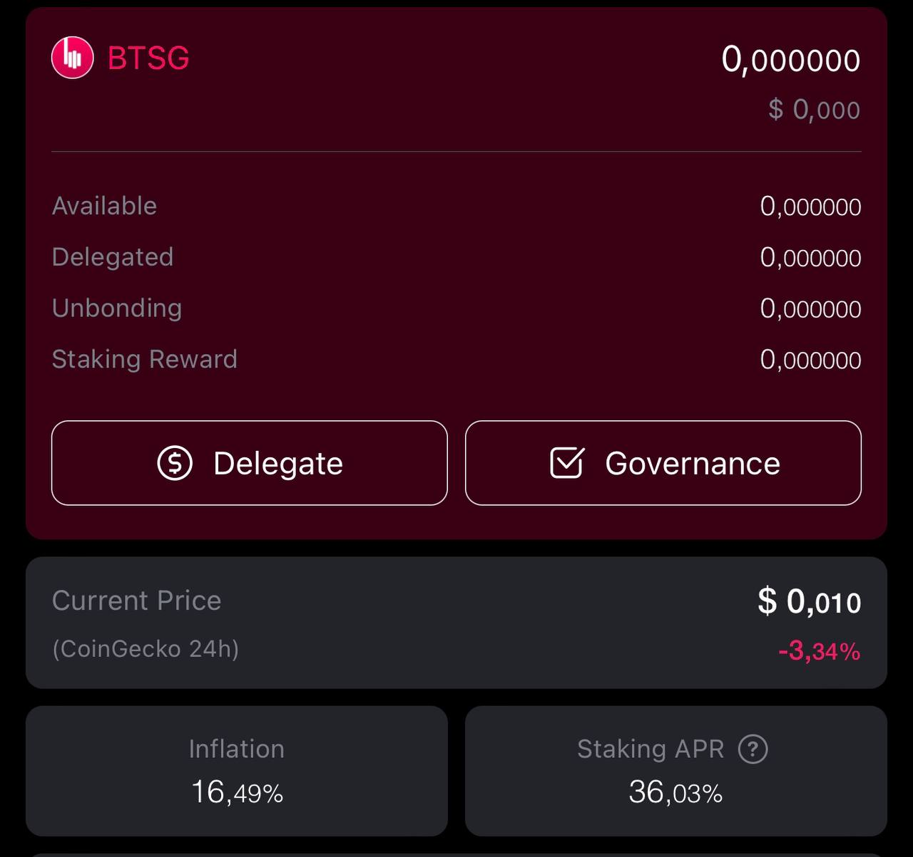
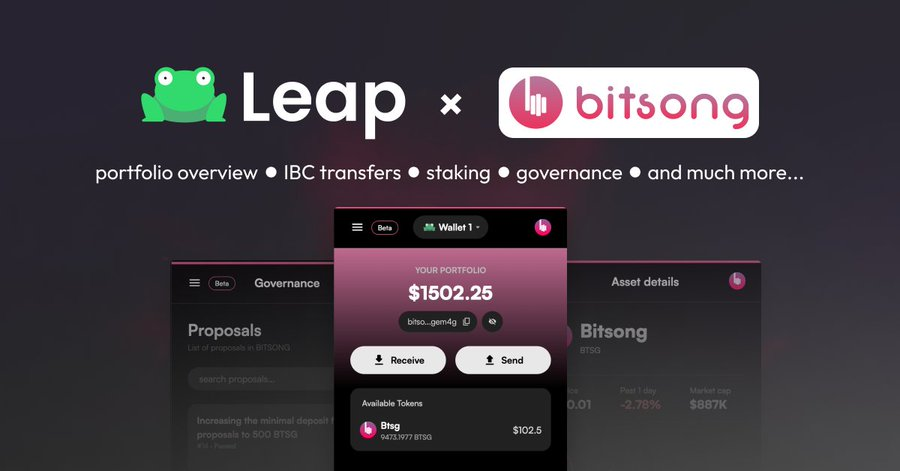
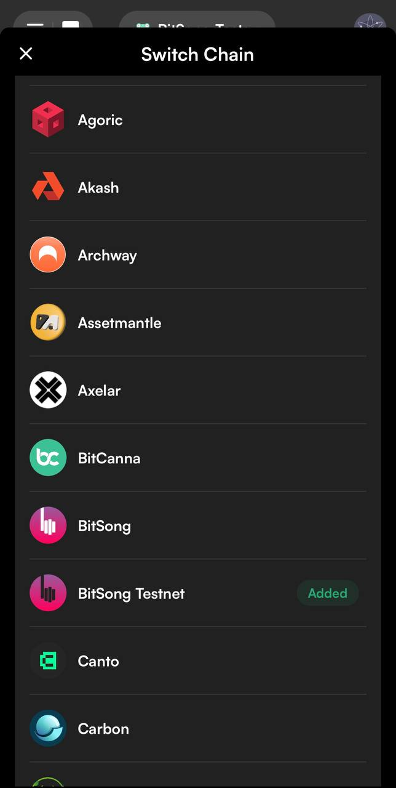

# Wallets

## BTSG-supported Wallets

BitSong recommends using the Bitsong/Keplr wallet for BitSong mainnet BTSG tokens management from desktop.\
You can access our [UI Dashboard](https://wallet.bitsong.io) via Keplr and perform transfers or governance actions (recommended).

<figure><figcaption></figcaption></figure>

### Keplr

Keplr is a browser extension wallet designed to support the Cosmos Internet of Blockchains. You can use Keplr to store, send, or receive mainnet-BTSG tokens. You can also stake your BTSG tokens directly to a Validator on the BitSong mainnet from your Keplr wallet.

You will need the Chrome browser (or Brave) to use the Keplr wallet. You can download the wallet from the [Chrome browser extension page](https://chrome.google.com/webstore/detail/keplr/dmkamcknogkgcdfhhbddcghachkejeap). You will then need to add the BitSong mainnet to your Keplr wallet [following these instructions.](../useful-guides/wallet/how-to-create-a-bitsong-wallet.md)&#x20;

### Cosmostation

#### Web Wallet

Access your account on [Cosmostation web wallet](https://wallet.cosmostation.io/cosmos) via Ledger hardware wallet or Keystation powered by Cosmostation.

<figure><figcaption></figcaption></figure>

#### Extension Wallet

[Cosmostation Wallet Extension](https://chrome.google.com/webstore/detail/cosmostation/fpkhgmpbidmiogeglndfbkegfdlnajnf?utm_source=chrome-ntp-icon) is a 100% non-custodial chrome extension wallet that supports multiple sovereign networks and inter-chain bridges.

<figure><figcaption></figcaption></figure>

#### Mobile Wallet

Industry leading non-custodial mobile wallet designed for PoS blockchains. Explore the interchain in the palm of your hand.\
\
1\. Get it on [Google Play](https://play.google.com/store/apps/details?id=wannabit.io.cosmostaion)\
2\. Get in on [App Store](https://apps.apple.com/kr/app/cosmostation/id1459830339)

<figure><figcaption></figcaption></figure>

## Leap Wallet

Leap is a non-custodial super wallet for web3. It is already live on Cosmos & Terra 2.0, while it is expected to be deployed soon on Avalanche too.

#### Wallet Extension

BitSong is integrated with full support into Leap Wallet Extension. \
In order to manage your $BTSGs via Leap Wallet you'll need to install [Leap Wallet Web extension for Cosmos.](https://chrome.google.com/webstore/detail/leap-cosmos-wallet/fcfcfllfndlomdhbehjjcoimbgofdncg/?utm_source=website\&utm_medium=permanent-website\&utm_campaign=permanent)\
Open a new wallet or import one via the available options and start managing your BTSGs on Leap Wallet.

<figure><figcaption></figcaption></figure>

#### Mobile App Wallet (Full Support for BitSong)

1. Get it for [**Android**](https://www.leapwallet.io/cosmos)
2. Get it for [**iOS**](https://www.leapwallet.io/cosmos)

<figure><figcaption></figcaption></figure>

Once you downloaded and installed the app, you need to create or import your wallet into it.\
After you wallet is set, then all you need to do is clicking on the blockchain icon (upper right) which usually is set to Cosmos Blockchain by default and looking for BitSong in the chains list as in the image below.\
Select the BitSong Blockchain from the list and you're all set, ready to copy and distribute your bitsong wallet address.

<figure><figcaption></figcaption></figure>

