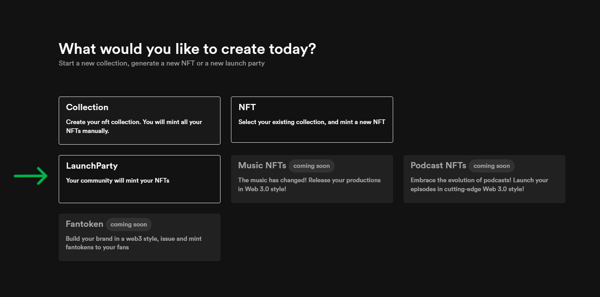
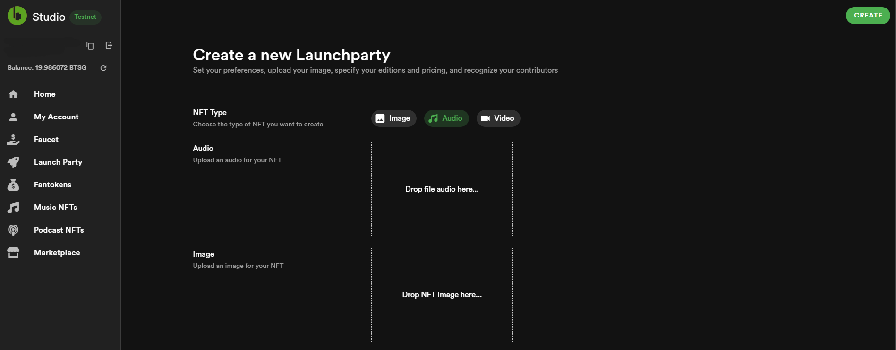
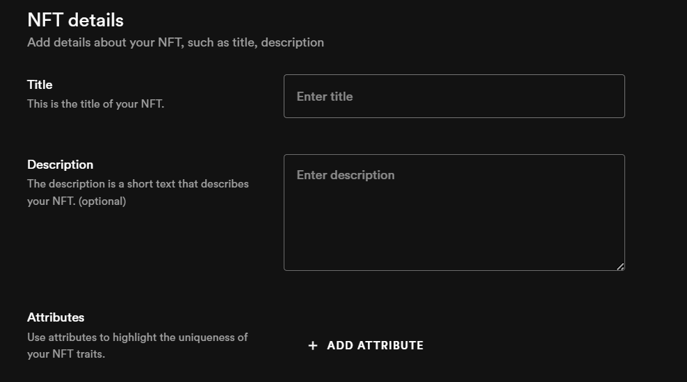
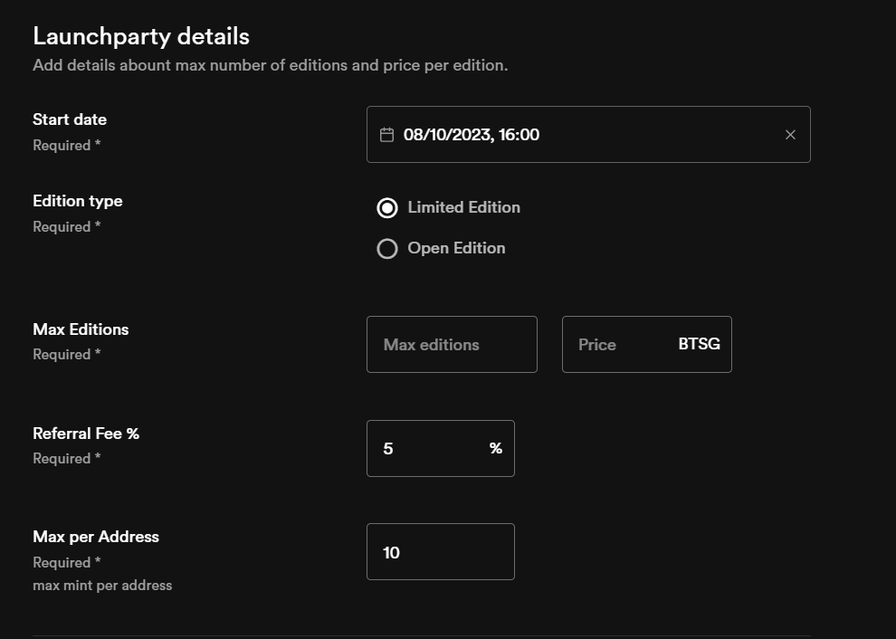
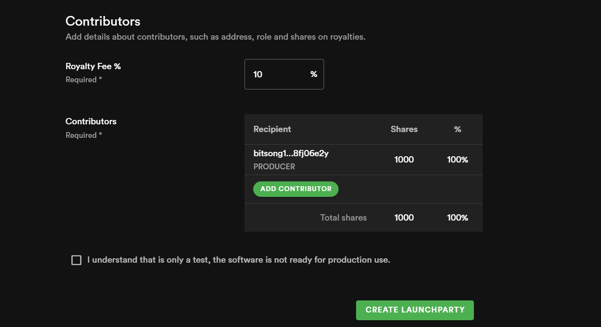

# 🎉Create LaunchParty

The term "[**LaunchParty**](https://testnet.bitsong.studio/create/launch-party)" has been ingeniously embraced as a metaphorical embodiment of the deep passion we share for music. However, it's vital to grasp the underlying concept: it serves as a **strategic launchpad meticulously crafted for the realm of NFTs**. While metaphorically aligned with the celebratory essence of a party, its true essence lies in propelling NFTs to new heights. This creative use of language encapsulates our appreciation for music's vibrancy while signifying the platform's role as a springboard for NFTs' innovative journey.

🚀 Are you ready to experience music and NFTs like never before? \
**BitSong Studio proudly presents the game-changing** [**LaunchParty**](https://testnet.bitsong.studio/launch-party), a dynamic feature that intertwines the fervor of music with the limitless potential of NFTs. It empowers creators and fans alike to immerse themselves in a world where artistic expression and cutting-edge technology converge, revolutionizing the way we perceive and share music.

<figure><figcaption></figcaption></figure>

**Unveiling the LaunchParty: A Fusion of Creativity and Innovation**

Imagine a fusion of music’s electrifying energy with the groundbreaking possibilities of NFTs. The LaunchParty is more than a term; it’s a portal to transform your musical passion into NFT artistry.&#x20;

Here’s how it works:

* 🎵 **NFT Variety**: Choose the form your NFT will take — from mesmerizing images and captivating audio to spellbinding videos. Each medium contributes to crafting a unique NFT experience that resonates with your artistic vision.
* 🖼️ **Images and Covers**: Infuse your NFT with visual allure by uploading your image and optional cover image. These visuals provide a captivating glimpse into the soul of your creation.
* 💡 **NFT Details**: Your NFT’s title and description are the heartbeats of your creation, encapsulating its essence and purpose in a few words.
* 🎨 **Attributes**: Highlight the distinctive traits of your NFT using attributes. These nuances accentuate the exclusive value that your creation holds.

<figure><figcaption></figcaption></figure>

 

<figure><figcaption></figcaption></figure>

**🎉 Launchparty Details: Define the trajectory of your NFT’s journey with precision.**

* **Start Date**: On the calendar of innovation, choose when your LaunchParty takes flight.
* **Edition Type**: Lay the groundwork for the exclusivity of your NFT with the maximum editions available.
* **Price**: Determine the value in BTSG that encapsulates the worth of your artistry.
* **Referral Fee** **%**: Extend the celebration by allocating a portion to those who amplify your impact.
* **Max per Address**: Set the limit on how many times a single address can mint your extraordinary NFT.

<figure><figcaption></figcaption></figure>

**👥 Contributors: Collaborate and celebrate with fellow visionaries.**

* **Royalty Fee %**: Empower creators through perpetual royalties with a percentage earned from secondary NFT sales.
* **Contributors**: Pay homage to those who’ve added their magic to your creation by revealing their roles and shares.

<figure><figcaption></figcaption></figure>

With the LaunchParty, BitSong Studio transcends traditional boundaries, embracing a future where music and NFTs interlace harmoniously. The launchpad for this artistic revolution is now available at your fingertips, waiting for you to embark on an extraordinary journey of innovation, expression, and discovery.
