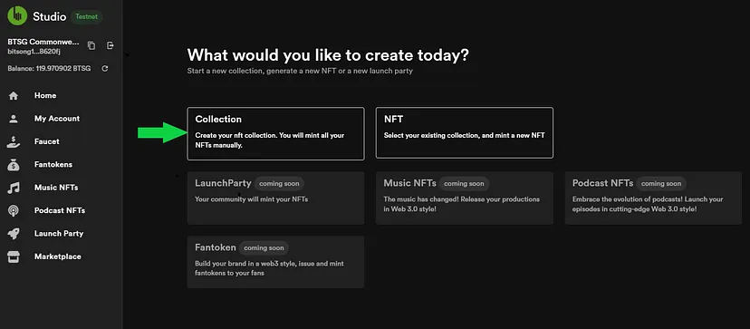

# 🎼Create NFT Collection

<figure><figcaption></figcaption></figure>

🚀🎨 Creating Your Own NFT Collection on [**BitSong Studio**](https://testnet.bitsong.studio)!

If you're an artist looking to make your mark in the world of NFTs, BitSong Studio is the perfect platform for you! Here's a step-by-step guide on how to create your very own NFT collection with ease.🎉

First things first, head over to BitSong Studio and either [**connect your wallet to the UI**](wallet-authentication.md) via the available options. Your journey to becoming an NFT creator begins here! 🔑💻

Before you can interact with the platform and create NFTs, you'll need to [**get faucet tokens**](get-faucet-tokens.md) to cover the transaction fees. These tokens are provided for free, and they enable you to mint your NFTs without any additional costs.

Once you have your faucet tokens, look for the "[**Create NFT Collection**](https://testnet.bitsong.studio/create/collection)" option as in the image above☝️. Click on it to access the NFT creation page, where you can set up your unique collection. 🖼️🎧🎸

<figure><figcaption></figcaption></figure>

This is where your artistic genius shines! Design your NFT collection by uploading high-quality images, music tracks or videos or digital artwork. Be sure to give your collection a catchy title and a captivating description. This is what will attract collectors to your NFTs.\
\
**Quick video tutorial here**👇


