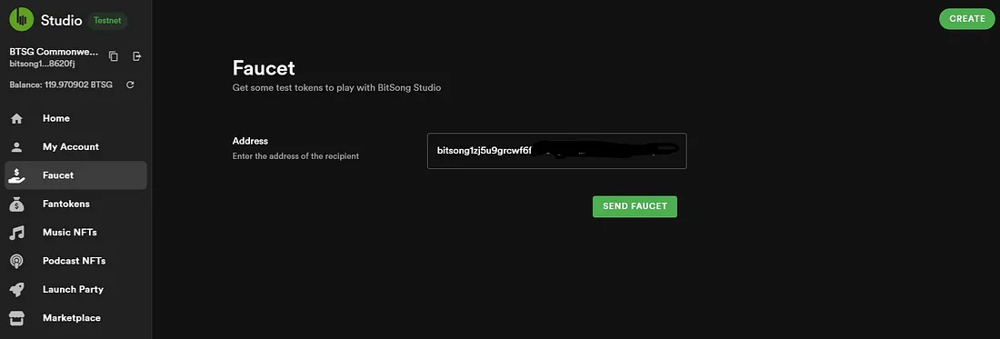

# 💸Get Faucet Tokens

As a new artist or enthusiast, we understand that starting may require a little boost in order to start testing such a futuristic tool. The bStudio Faucet is designed just for that purpose. Access a limited supply of BitSong testnet tokens to get you started on your creative journey or explore the BitSong marketplace with ease. \
_**Do not forget that we are currently running in a BETA environment, thus meaning that all tokens you will transact are NOT REAL token but Testnet ones.**_

💡 Why are faucet tokens required? \
BitSong Studio is still in the testing phase, and we want to ensure a seamless experience for all users. Faucet tokens allow us to monitor and collect valuable feedback from our community, helping us improve and refine the product.\
\
🔗**Step 1** \
Visit [https://testnet.bitsong.studio](https://t.co/ea1PzsFYgo) and connect to BitSongStudio as explained [**here**](wallet-authentication.md). It's a quick process, and you'll gain access to our WEB3 Music platform's amazing features!\
💰**Step 2**\
To interact with BitSong Studio, you'll need faucet tokens. These tokens are like trial credits that allow you to explore the Beta version without spending actual money.\
🚀**Step 3** \
Once you're connected, go to the "Faucet" section on your BitSong Studio account. Here, you can request faucet tokens by following the video instructions beyond 👇



<figure><figcaption></figcaption></figure>

⏳**Step 4** \
After requesting the faucet tokens, a small amount will be credited to your account. These tokens are meant for testing purposes only and cannot be transferred to external wallets.

🎵**Step 5** \
Now, you're all set to dive into the BitSong Studio Beta! The faucet tokens will grant you access to explore and interact with the exciting features and functionalities we've been working on.

