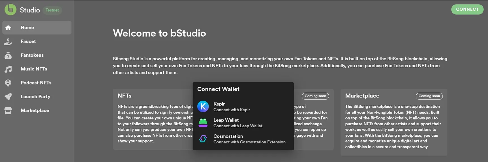

# 🔑Wallet Authentication

**Wallet Authentication**\
[**BitSong Studio**](https://testnet.bitsong.studio/) ensures secure and seamless access to your digital assets through wallet authentication. Your cryptocurrency wallet will serve as a key to unlock all the features and functionalities that bStudio has to offer, guaranteeing a private and secure environment for your creative endeavors.

In the event you don't have a BitSong Wallet yet, please refer to the "[**How to Create a BitSong Wallet**](create-bitsong-wallet.md)" Guide, which is a fast and easy process!

There are multiple authentication options at your disposal such as:

* Keplr (via web)
* Leap Wallet (via web and mobile)
* Cosmostation (via web)

<figure><figcaption></figcaption></figure>

 

<figure><figcaption></figcaption></figure>

**Quick video guide**👇


